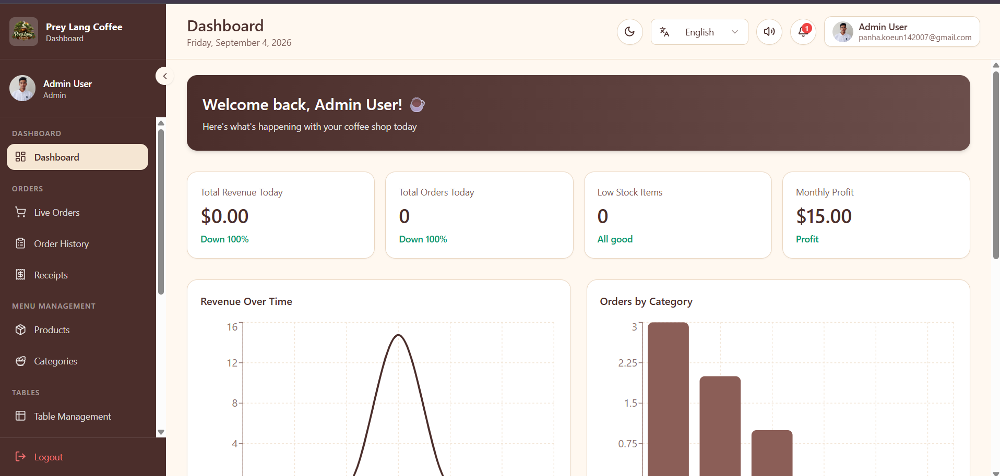
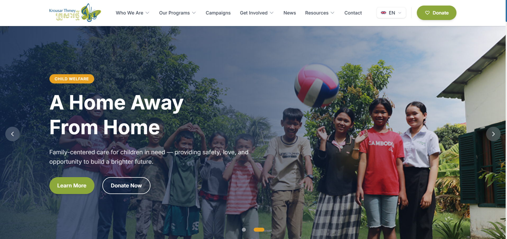

  

  

 

  <i>A passionate developer focused on building efficient web applications and robust business systems, bridging the gap between business needs and technical solutions.</i>

---

### 👨‍💻 About Me & What I Do

<table>
  <tr>
    <td valign="top" width="55%">
       
      <ul>
        <li>🔭 I’m currently developing custom modules for <strong>Odoo</strong> and building dynamic web apps.</li>
        <li>🌱 I’m currently mastering <strong>Odoo 19, Advanced Python, & PostgreSQL</strong>.</li>
        <li>💼 With over <strong>60+ repositories</strong> across my profiles, I am constantly exploring and building.</li>
        <li>📫 Connect with me on: <a href="https://github.com/panhakoeun142007-creator">Main Profile</a> | <a href="https://github.com/Panhakoeun">Secondary Profile</a></li>
      </ul>
    </td>
    <td align="center" width="45%">
      
    </td>
  </tr>
</table>

---

### 🚀 Featured Projects

<table align="center">
  <tr>
    <td align="center" width="50%">
      
        
      
       
      <a href="https://prey-lang-coffee-pos-system.vercel.app/"><strong>🔗 Live Demo</strong></a>
    </td>
    <td align="center" width="50%">
      
        
      
       
      <a href="https://krousar-thmey.sreydeth.site/"><strong>🔗 Live Demo</strong></a>
    </td>
  </tr>
</table>

---

### 🛠️ Tech Stack & Arsenal

 

  

 

  
  
  
  
  
  
  

---

### 📊 GitHub Analytics

  
  

---

### 🌟 Let's Connect

  
  
  

 

  

